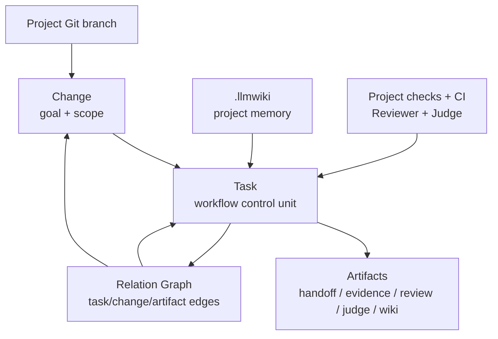
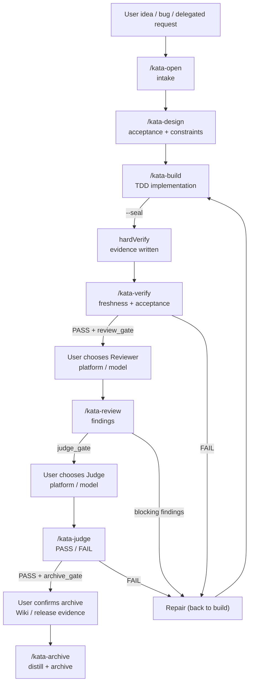
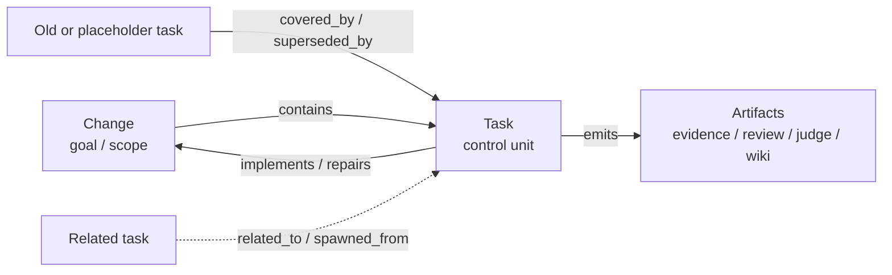
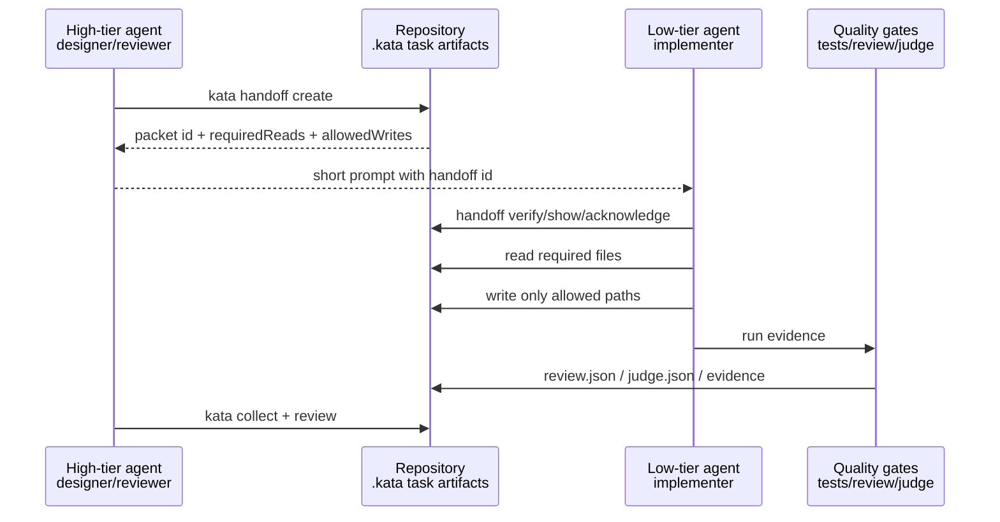
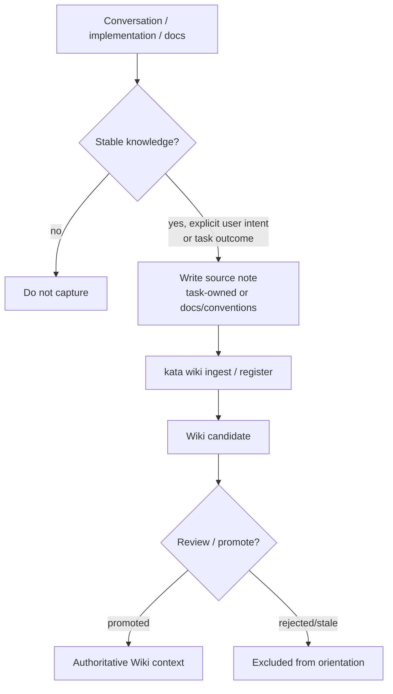
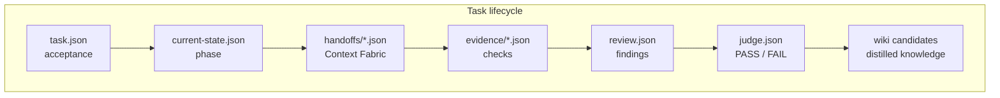

# Kata

[English](README.md) · [中文](README_ZH.md)

Kata is a cross-platform AI coding workflow governance framework. It provides a governed task lifecycle, evidence-based quality gates, and a provenance-aware project Wiki for Codex, Claude Code, OpenCode, and other AI coding platforms.

The platform-neutral handoff protocol is documented in [Context Fabric](./docs/context-fabric.md).

Kata's north star:

> Wiki helps agents avoid project-context mistakes; CI, tests, Reviewer, and Judge prevent code-correctness mistakes.

## Quick start

```bash
cd /app/kata
npm install
npm run build

# Initialize in your project
node dist/cli.js init --root /path/to/your-project
# Or with an explicit platform
node dist/cli.js init --platform opencode --root /path/to/your-project
```

`kata init` detects installed coding platforms, installs matching Skills/rules/hooks, initializes `.kata/`, initializes `.llmwiki/` when project docs exist, and coordinates Comet project initialization in one command. The selected response language is persisted in `.kata-config.json`; subsequent `kata update` runs reuse it when regenerating Skills and project rules.

After initialization, use slash commands in your AI coding tool:

- `/kata-open <change>` — start a governed change with workflow profile
- `/kata-design <change>` — define acceptance criteria and design constraints
- `/kata-build <change>` — TDD implementation; `--seal` to collect evidence and advance
- `/kata-verify <change>` — verify evidence freshness, acceptance coverage, and blocking issues
- `/kata-review <change>` — independent Reviewer findings
- `/kata-judge <change>` — independent Judge PASS / FAIL per acceptance criterion
- `/kata-archive <change>` — distill Wiki knowledge and archive
- `/kata-hotfix <change>` — fast bug fix (open → design → build in one shot)
- `/kata-tweak <change>` — lightweight docs/config/prompt change (auto open → design)
- `/kata-collect` — collect delegated work from another platform

Full CLI:

```
kata <init|update|uninstall|discover|doctor|wiki|tasks|relations|orient|hooks|
     handoff|collect|comet|codegraph|git-flow|status|open|design|build|
     verify|archive|hotfix|tweak|next>
```

## System architecture

Kata separates goal management from workflow control:

- **Change** is a goal and scope container: what the project wants to achieve.
- **Task** is the smallest governed workflow unit. It owns the current phase, acceptance contract, evidence, review, judge, and archive state.
- **Artifact** is the auditable output of each phase: handoff packets, evidence files, review findings, judge decisions, Wiki candidates, and archive records.
- **Relation Graph** connects `task`, `change`, and `artifact` nodes for placeholders, delegation, repairs, supercessions, and implementations.
- **Wiki** provides orientation context; it is not correctness proof. Correctness is guarded by project checks, CI, Reviewer, and Judge.



This split is critical for cross-platform work. A high-tier agent may design or review a change, a low-tier agent may implement one task, and another platform may judge the result. They do not need to share chat history; they read the same repository artifacts.

## Task flow

### Phase lifecycle

Tasks move through 8 phases: `intake → plan → implement → hardVerify → review → judge → distill → archive`.

| Command | Entry phase | Exit phase | Responsibility |
|---------|-------------|------------|----------------|
| `/kata-open` | — | `intake` | Create task, record workflow profile (isolation, dev mode, review mode) |
| `/kata-design` | `intake` | `plan` | Define acceptance criteria and constraints, generate implementer handoff |
| `/kata-build` | `plan` / `implement` / `hardVerify` / `review` / `judge` | `implement` (no `--seal`) or `hardVerify` (`--seal`) | TDD implementation; `--seal` collects evidence and advances to hardVerify |
| `/kata-verify` | any | unchanged | Verify evidence freshness, acceptance coverage, and blocking issues |
| `/kata-review` | `hardVerify` | `review` | Independent reviewer findings (blocking / major / minor) |
| `/kata-judge` | `review` | `judge` | Independent PASS / FAIL per acceptance criterion |
| `/kata-archive` | `judge` / `distill` | `archive` | Knowledge distillation, Wiki capture, and archival |



Guiding principles:

- Wiki and handoff packets reduce "agent does not understand the project" mistakes.
- Tests, CI, Reviewer, and Judge reduce "the code is incorrect" mistakes.
- Kata does not route or configure models for different roles. Model selection is always the user's decision in their host platform.
- After each phase command, Kata returns `nextAction` with the recommended slash command, CLI fallback, whether user confirmation is required, and why.

### Trust-boundary pauses

When `nextAction.requiresUserConfirmation: true`, the agent must stop and ask before invoking the next `/kata-*` skill:

| Boundary | When it appears | User choice |
|----------|-----------------|-------------|
| `review_gate` | after `/kata-verify` passes | keep current platform/model, or switch |
| `judge_gate` | after `/kata-review` completes | keep current platform/model, or switch to higher trust |
| `archive_gate` | after Judge PASS | archive now, enrich Wiki first, or collect release evidence |

## Relation graph

The Relation Graph prevents workflow drift across platforms. Terminal control relations (`covered_by`, `superseded_by`, `duplicate_of`, `merged_into`) are followed by `kata status` and `kata orient`, redirecting obsolete tasks to the active task. Context relations (`parent_of`, `spawned_from`, `related_to`) preserve lineage without changing dispatch.



Useful commands:

```bash
kata relations add --from change:<change-id> --to task:<task-id> --type contains
kata relations add --from task:<old-task> --to task:<active-task> --type covered_by
kata relations show --id change:<change-id>
```

## Cross-platform handoff

Kata connects coding platforms through Context Fabric packets. A packet anchors current Git HEAD, branch, worktree diff, task acceptance criteria, required reads, allowed writes, prior evidence, and guard instructions. When the workflow crosses role boundaries (designer → implementer, implementer → reviewer), Kata automatically creates a portable handoff packet.



Handoff commands:

```bash
kata handoff create --task <task-id> --from designer --to implementer
kata handoff verify --task <task-id> --id <handoff-id>
kata handoff show --task <task-id> --id <handoff-id>
kata handoff acknowledge --task <task-id> --id <handoff-id> --platform opencode --role implementer
```

## Model policy

Kata does not route, configure, or record host-platform model selection. The model policy is declarative in `.kata-config.json` under `modelPolicy`. At trust boundaries, `kata status` and `kata orient` return `nextAction.recommended` with role and tier guidance. Model selection is always the user's choice in their host platform's selector. Correctness belongs to tests, Reviewer, and Judge regardless of which model was used.

## Wiki and knowledge sedimentation

Kata does not dump chat logs into the Wiki. It captures stable, reusable project knowledge as governed candidates.

Use `kata wiki --help` to discover supported commands. The standard agent path:

```bash
kata wiki task --kind enrich --from docs    # extract knowledge from docs
kata wiki lint                               # check wiki format
kata wiki verify                             # verify source freshness (drift detection)
kata wiki register                           # register as candidate
kata wiki promote <wiki-id> --by <actor> --role distiller  # promote to authoritative
```

Every task must record a knowledge-closure decision before verification and archival:

```bash
kata wiki closure --task <task-id> --decision captured --reason "New API convention" --candidate <wiki-id>
kata wiki closure --task <task-id> --decision not_applicable --reason "Typo fix only"
```



Skills follow the conversation-capture covenant. Trigger when the user says things like "remember this", "add to wiki", or "沉淀到 wiki". Convert the point into a short source note with date, task id, rule/decision, rationale, and scope. Register it as a candidate; do not promote directly.

## Phase and artifact map



## Workflow profile

`/kata-open` supports these profile options:

| Option | Values | Description |
|--------|--------|-------------|
| Isolation | `current_worktree` / `isolated_worktree` / `git_flow` / `user_decides` | Use a dedicated branch or git flow |
| Dev mode | `tdd` / `standard` | TDD requires failing tests first |
| Review mode | `std` / `strict` / `security` | strict mode enforces fixing all major findings |

## Acceptance matrix

Tasks may include an `acceptanceMatrix` that maps each acceptance criterion to concrete implementation paths, test paths, and evidence check commands. With `strictClosure` enabled, `--seal` validates that owned paths cover all declared matrix paths and runs the corresponding checks to collect evidence.

## Documentation

- [Installation](./docs/installation.md) — per-platform setup, scopes, CI
- [Usage guide](./docs/usage-guide.md) — day-to-day agent workflow, Wiki loop, model routing, quality gates
- [Configuration](./docs/configuration.md) — model policy, tiers, budgets
- [Wiki lifecycle](./docs/wiki.md) — provenance, drift, conflict, promotion
- [Context Fabric](./docs/context-fabric.md) — platform-neutral handoff protocol
- [Platform adapters](./docs/platform-adapters.md) — per-platform adapter implementation
- [Operations](./docs/operations.md) — CLI reference, eval, release gates
- [Troubleshooting](./docs/troubleshooting.md) — common issues and recovery
