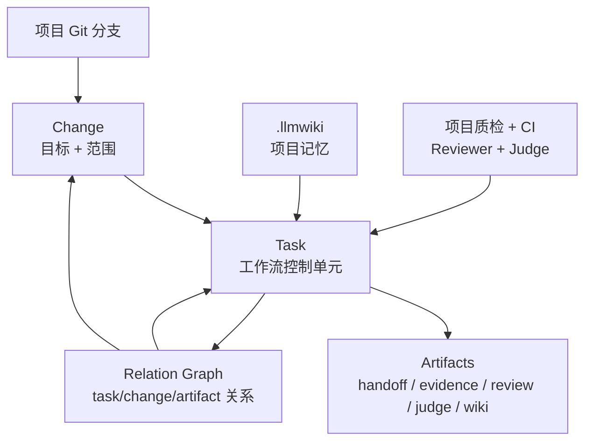
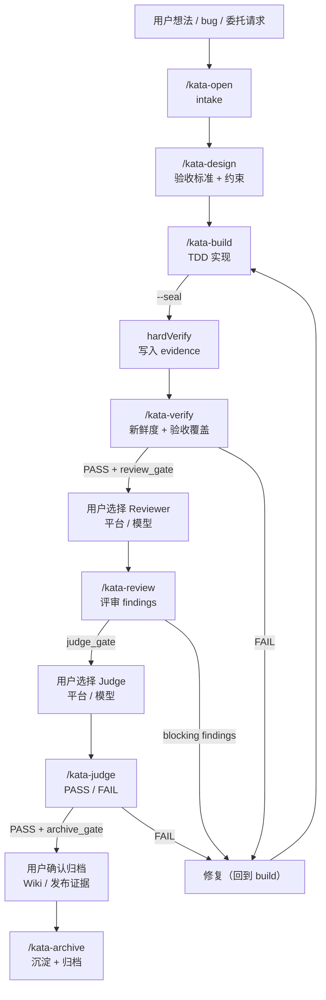
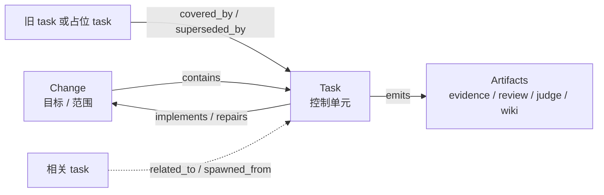
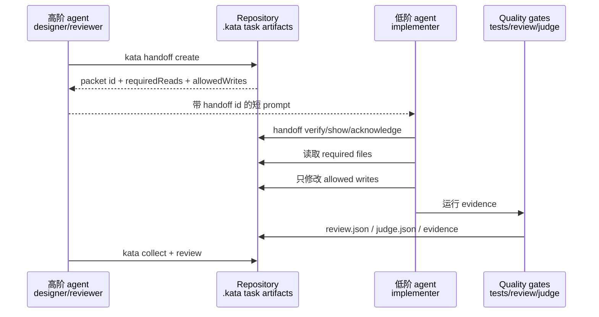
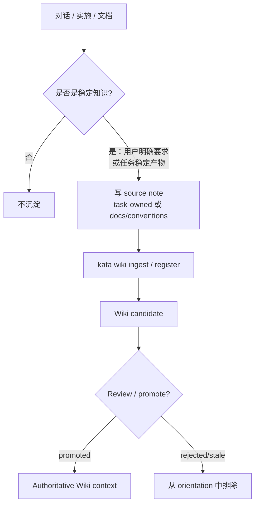
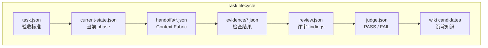

# Kata

[English](README.md) · [中文](README_ZH.md)

Kata 是一个跨平台 AI 编码工作流治理框架。通过受控的任务生命周期、基于证据的质量门禁和带来源治理的项目 Wiki，为 Codex、Claude Code、OpenCode 等 AI coding 平台提供统一的流程与质量保障。

平台无关的上下文交接协议见 [Context Fabric](./docs/context-fabric.md)。

Kata 的核心目标是：

> Wiki 帮助 agent 少犯"不了解项目"的错；CI、测试、Reviewer、Judge 负责防止"代码本身不正确"的错。

## 快速开始

```bash
cd /app/kata
npm install
npm run build

# 在你的项目中初始化
node dist/cli.js init --root /path/to/your-project
# 或显式指定平台
node dist/cli.js init --platform opencode --root /path/to/your-project
```

`kata init` 自动发现项目中已安装的 coding 平台，安装对应的 Skills、rules、hooks，初始化 `.kata/`，在存在项目文档时初始化 `.llmwiki/`，并在同一命令内协调 Comet 项目初始化。初始化时选择的响应语言会写入 `.kata-config.json`，后续 `kata update` 重新生成 Skills 和项目规则时会自动继承。

初始化后，在你的 AI coding 工具里使用 slash commands：

- `/kata-open <change>` — 开启一个受治理 change，记录 workflow profile
- `/kata-design <change>` — 明确验收标准与设计约束，生成 implementer handoff
- `/kata-build <change>` — TDD 实现；`--seal` 封存 evidence 并推进到 hardVerify
- `/kata-verify <change>` — 校验 evidence 新鲜度、验收覆盖和阻塞问题
- `/kata-review <change>` — 独立 Reviewer 记录评审 findings
- `/kata-judge <change>` — 独立 Judge 逐条验收标准给出 PASS / FAIL
- `/kata-archive <change>` — 知识蒸馏、Wiki 沉淀并归档
- `/kata-hotfix <change>` — 快速修复 bug（open→design→build 一键串联）
- `/kata-tweak <change>` — 轻量文档/配置/提示词修改（open→design 自动完成）
- `/kata-collect` — 从其他平台收集工作成果

完整 CLI 命令：

```
kata <init|update|uninstall|discover|doctor|wiki|tasks|relations|orient|hooks|
     handoff|collect|comet|codegraph|git-flow|status|open|design|build|
     verify|archive|hotfix|tweak|next>
```

## 系统结构

Kata 将"目标管理"与"工作流控制"分离：

- **Change** 是目标与范围容器，描述项目要完成什么。
- **Task** 是最小受治理工作流单元，拥有当前阶段、验收契约、evidence、review、judge 和 archive 状态。
- **Artifact** 是每个阶段产生的可审计产物：handoff packet、evidence 文件、review findings、judge 决策、Wiki candidate 和归档记录。
- **Relation Graph** 连接 `task`、`change`、`artifact` 节点，表达占位、委托、修复、替代、实现等关系。
- **Wiki** 提供项目上下文，帮助 agent 避免"不理解项目"的错；代码正确性由项目质检、CI、Reviewer、Judge 兜底。



这个拆分对跨平台协作很关键：高阶模型负责设计或评审，低阶模型实施 task，另一个平台做 Judge。它们不共享聊天记录，只读取同一套仓库内结构化产物。

## 任务流转

### Phase 生命周期

Task 经过 8 个阶段：`intake → plan → implement → hardVerify → review → judge → distill → archive`。

| 命令 | 入口阶段 | 出口阶段 | 职责 |
|------|----------|----------|------|
| `/kata-open` | — | `intake` | 创建 task，记录 workflow profile（隔离方式、开发模式、审查模式） |
| `/kata-design` | `intake` | `plan` | 明确验收标准与设计约束，生成 implementer handoff |
| `/kata-build` | `plan` / `implement` / `hardVerify` / `review` / `judge` | `implement`（无 `--seal`）或 `hardVerify`（`--seal`） | TDD 实现；`--seal` 收集 evidence 并推进到 hardVerify |
| `/kata-verify` | 任意 | 不变 | 校验 evidence 新鲜度、验收覆盖和阻塞问题，不改变 phase |
| `/kata-review` | `hardVerify` | `review` | 独立 Reviewer 记录 findings（blocking / major / minor） |
| `/kata-judge` | `review` | `judge` | 独立 Judge 逐条验收标准给出 PASS / FAIL |
| `/kata-archive` | `judge` / `distill` | `archive` | 知识蒸馏、Wiki 沉淀、归档 |



基本原则：

- Wiki 和 handoff packet 用来减少"agent 不了解项目"的错。
- 测试、CI、Reviewer、Judge 用来减少"代码不正确"的错。
- Kata 不为不同角色路由或配置模型，模型选择由用户或当前 host agent 决定。
- 每个阶段命令结束后，Kata 返回 `nextAction`，包含推荐的下一条 slash command、CLI fallback、是否需要用户确认，以及为何必须暂停。

### 信任边界暂停

当 `nextAction.requiresUserConfirmation: true` 时，agent 不能自动调用下一条 `/kata-*` skill，必须先询问用户：

| 边界 | 出现场景 | 用户选择 |
|------|----------|----------|
| `review_gate` | `/kata-verify` 通过后 | 当前平台/模型 review、切换平台/模型、或委托其他 agent |
| `judge_gate` | `/kata-review` 完成后 | 当前平台/模型 judge、切换到高阶模型/平台、或委托其他 agent |
| `archive_gate` | Judge PASS 后 | 立即归档、先补 Wiki、或补充发布证据 |

## 关系图

Relation Graph 防止多平台协作时的任务漂移。终止性控制关系（`covered_by`、`superseded_by`、`duplicate_of`、`merged_into`）会被 `kata status` 和 `kata orient` 跟随，旧任务自动重定向到当前活跃任务。上下文关系（`parent_of`、`spawned_from`、`related_to`）只保留来源线索，不改变调度。



常用命令：

```bash
kata relations add --from change:<change-id> --to task:<task-id> --type contains
kata relations add --from task:<old-task> --to task:<active-task> --type covered_by
kata relations show --id change:<change-id>
```

## 跨平台交接

Kata 通过 Context Fabric packet 连接各 AI coding 平台。packet 锚定当前 Git HEAD、分支、工作区 diff、任务验收标准、必读文件、允许写入路径、历史 evidence 和 guard instructions。当工作流跨越角色边界时（如 designer→implementer、implementer→reviewer），Kata 自动创建 portable handoff packet。



Handoff 命令：

```bash
kata handoff create --task <task-id> --from designer --to implementer
kata handoff verify --task <task-id> --id <handoff-id>
kata handoff show --task <task-id> --id <handoff-id>
kata handoff acknowledge --task <task-id> --id <handoff-id> --platform opencode --role implementer
```

## 模型路由

Kata 不为不同角色推荐模型层级，不路由也不记录宿主平台模型。模型选择由用户或当前 host agent 决定。`kata status` 会返回 `nextAction`，其中 `recommended` 字段包含建议的角色和对应的模型 tier 策略。若需切换模型，请在宿主平台自己的模型选择器中完成后再继续。

Kata 的模型策略（economy / capable / frontier tier，含路由模式和预算限制）通过 `.kata-config.json` 的 `modelPolicy` 字段配置，无需 CLI 命令。

## Wiki 与知识沉淀

Kata 不会把聊天记录写进 Wiki。它只把稳定、可复用、可治理的项目知识沉淀为 candidate。

使用 `kata wiki --help` 查看支持的命令。Agent 的标准路径：

```bash
kata wiki task --kind enrich --from docs    # 从文档提取知识
kata wiki lint                               # 检查 wiki 格式
kata wiki verify                             # 校验来源新鲜度（漂移检测）
kata wiki register                           # 注册为 candidate
kata wiki promote <wiki-id> --by <actor> --role distiller  # promote 为权威条目
```

每个 task 必须在 verify 和 archive 前记录知识闭环决策：

```bash
kata wiki closure --task <task-id> --decision captured --reason "新增 API 规范" --candidate <wiki-id>
kata wiki closure --task <task-id> --decision not_applicable --reason "仅修复拼写错误"
```



Skills 遵守 conversation-capture covenant：

- 当用户说"记住这个""沉淀到 wiki""以后都按这个""record this rule""add to wiki"等表达时触发。
- 先把内容整理成简短 source note，包含日期、task id、规则/决策、理由和适用范围。
- task 内知识优先写到 `.kata/tasks/<task-id>/wiki-notes/`。
- 长期稳定规则写到 `docs/conventions/`。
- 只注册为 candidate，不直接 promote。

## 阶段与产物映射



## 工作流 Profile

`/kata-open` 支持配置以下 profile：

| 选项 | 可选值 | 说明 |
|------|--------|------|
| 隔离方式 | `current_worktree` / `isolated_worktree` / `git_flow` / `user_decides` | 是否使用独立分支或 git flow |
| 开发模式 | `tdd` / `standard` | TDD 要求先写失败测试 |
| 审查模式 | `std` / `strict` / `security` | strict 模式强制修复所有 major findings |

## Acceptance Matrix

Task 可以包含一个 `acceptanceMatrix`，将每条验收标准映射到具体的实现路径、测试路径和 evidence 检查命令。启用 `strictClosure` 后，`--seal` 会验证 owned paths 覆盖矩阵中声明的所有路径，并运行对应的检查命令来收集 evidence。

## 文档

- [安装指南](./docs/installation.md) — 各平台安装、scope、CI
- [使用指南](./docs/usage-guide.md) — 日常 agent 工作流、Wiki 闭环、模型路由、质量门
- [配置](./docs/configuration.md) — 模型策略、tiers、预算
- [Wiki 生命周期](./docs/wiki.md) — 来源、漂移、冲突、promotion
- [Context Fabric](./docs/context-fabric.md) — 平台无关的上下文交接协议
- [平台适配器](./docs/platform-adapters.md) — 各平台适配器实现
- [运维](./docs/operations.md) — CLI 参考、eval、release gates
- [故障排除](./docs/troubleshooting.md) — 常见问题与恢复
