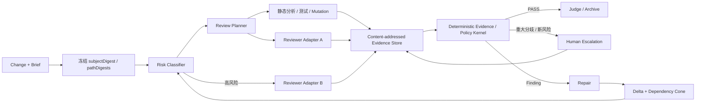
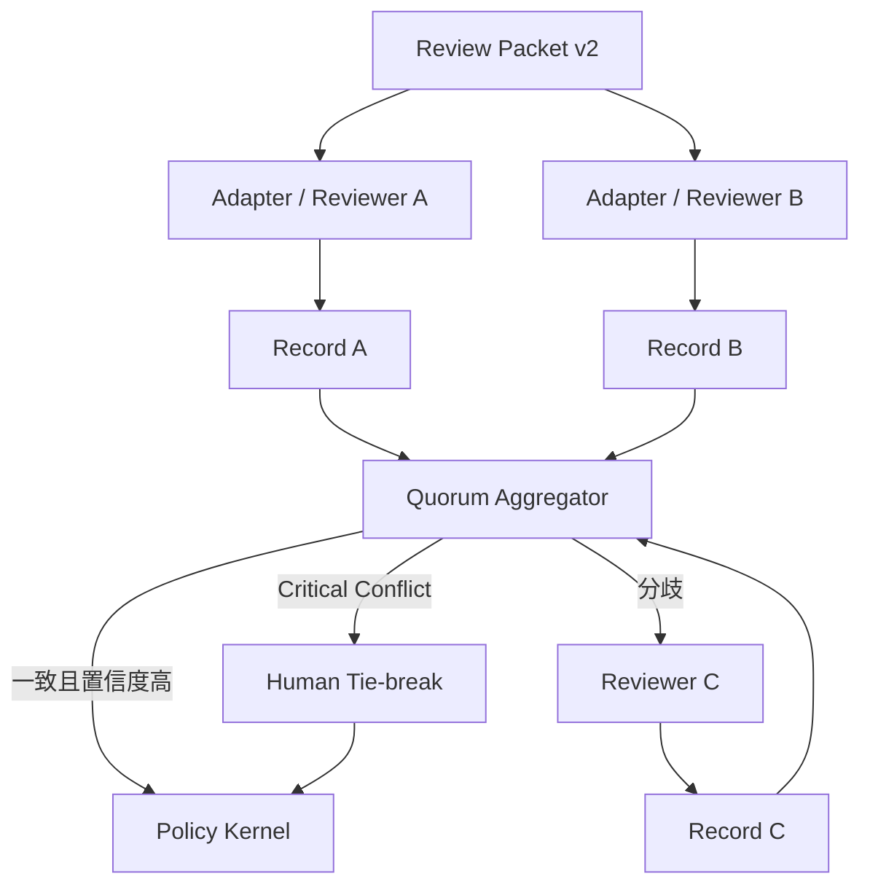
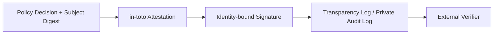

# 评审体系发散性重构研究：质量保证、成本压缩与平台解耦

## 执行摘要

本研究的核心结论是：**现有方案的主要问题已经不再是“如何把某个平台的独立审查会话认证得更可靠”，而是把“评审质量”“执行过程可信”“成本治理”“平台适配”四种不同问题挤进了同一个轮次认证机制。** 这导致任何一项加强都会放大另外几项的成本：为了证明独立性而绑定具体宿主执行过程；为了保证 revision 一致性而让修复立即使刚完成的审查失效；为了追求 finding 清零而形成开放式循环；为了避免漏审又不断增加轮次和 token。

附件中的实测数据已经足以说明这种结构性矛盾：一轮评审约消耗 **350K–660K tokens**，62 轮中有 28 轮没有产生记录，零记录率约 **45.2%**；某变更通过评审后仅 11 分钟，就因兄弟 change 修改共享路径而全部 evidence stale；四轮的 23 条 finding 中有 15 条是在审查前一小时的修复；某 change 十轮 finding 数量甚至从 7 演化为 14，并不存在自然单调收敛。与此同时，`strict/security` 又因为强依赖 execution receipt 而被宿主能力卡住。fileciteturn0file0

因此，我不建议简单在当前方案上继续强化 receipt、executor、agent identity 或事件流，也不建议直接把系统“大拆微服务”。**推荐目标架构是“证据内核 + 风险自适应评审网格”**：

> **把稳定、平台无关的“评审语义”缩成一个很小的确定性 Evidence/Policy Kernel；把 LLM、人、静态分析、变异测试、不同平台 agent 都视为可替换的 evidence producer；用风险路由决定何时单评审、何时 quorum、何时人工升级；用 delta certification 复用未变化内容的证据；把执行过程证明、身份、签名和外部审计降为独立的 assurance overlay（运行隔离由宿主平台承担，Kata 不作本地沙箱声明），而不是所有质量判定的硬前置条件。**

这一方向与附件提出的“执行者是不可信提案者、确定性裁判读取产物”一致，但需要三处关键修正。

**第一，不能把“产物正确”与“执行过程安全”完全等价。** 对 finding 是否成立、覆盖是否闭合、引用是否 grounded，可以主要依赖产物；但“没有秘密泄露”“没有临时写外部系统”“没有利用缓存影响后续运行”“确实运行在隔离环境”属于执行完整性与保密性问题，仅凭最终 workspace digest 无法证明。因此建议**从 semantic quality gate 中移除 receipt，但不要从 security/compliance assurance 中删除 process evidence**。SLSA 的 provenance 同样没有假定工件自身足以证明生产过程，而是明确把一部分信任放在受信 build platform / `builder.id` 上。citeturn13search2turn13search21

**第二，不建议按附件当前 R4 的一种可能解释——“修复本轮 finding 后不作废本轮”——直接豁免 revision 变化。** 修改过的代码客观上已经不是被审查的代码。正确方法是 **delta certification**：未变化的 digest 继续复用已获得 evidence；修改路径以及它们的依赖影响锥重新验证。这样同时保住“审查只认证真正看过的内容”和“一个小修复不用从头再花 350K–660K tokens”。Google 在大规模 mutation testing 中采取的也是增量思想：只对 changed code 做 mutation，并过滤低价值 mutant，而不是每次重新对整个代码库做全量 mutation。citeturn15search0

**第三，“每个 finding 必须有可执行 falsifier”不应成为唯一证据类型。** 它对逻辑 bug、回归、门条件失效非常强，但会系统性排斥架构风险、隐私泄漏设计、威胁模型缺口、跨文件不变量、API 兼容性、可维护性等难以构造成单一红测的高价值 finding。建议升级为**证据类型系统**：`executable_falsifier`、`static_witness`、`invariant_proof`、`cross_artifact_contradiction`、`expert_concurrence`，并按严重度决定最低证明强度。

综合质量、成本、去耦和实施风险，本研究给出的优先顺序是：

| 优先级 | 建议 | 判断 |
|---|---|---|
| **P0** | 严重度门真正启用；成本从“正确性条件”改为调度预算；建立 benchmark；质量与 provenance 分离；delta revalidation | **立即做** |
| **P1** | `ReviewRecord v2` + Evidence Kernel + Ports/Adapters + 风险自适应路由 | **目标主架构** |
| **P2** | strict/security 使用自适应第二/第三 reviewer + 人工仲裁 | **质量保险层** |
| **P3** | 多平台规模化后再引入事件总线、CloudEvents/AsyncAPI | **按规模触发** |
| **P4** | in-toto/Sigstore 用于跨组织/外部审计；众包/区块链只用于特殊场景 | **不要默认引入** |

按附件数据做一个仅供规划的成本归一化：若只考虑 28/62 的“零记录”损耗，一轮 350K–660K tokens 对应的“每个非零记录等价成本”已经约为 **0.64M–1.20M tokens**；这还**没有**计入记录被拒、stale revision、重复修复和人力，因此只是一个偏保守的下界。fileciteturn0file0 本报告把这个历史成本定义为 `C0`，后文所有成本用它作相对基准，而不是假设某个模型当前的美元价格。

在完成 benchmark 校准后，一个合理但**尚待实测验证**的工程目标是：标准档长期降至 **0.30–0.60 C0**，strict 档约 **0.60–1.00 C0**，security 档约 **0.90–1.50 C0**；即标准变更争取降低约 **40%–70%** 的评审成本，同时要求 critical recall 和 false-pass rate 不劣于当前基线。这个节省主要来自**不再把所有 change 当成最高风险 change、复用未变化 evidence、停止修 minor/nit 驱动新 revision、消灭无记录整轮浪费**，而不是通过降低质量阈值获得。

## 目标、约束与成功标准

附件实际上已经定义了相当清晰的局部方法论目标，但缺少一个更高层的目标函数。建议把评审体系重新定义成四个互相独立、可测的目标，而不是一个笼统的“独立评审认证”。

**质量目标。** 系统真正需要回答的不是“有没有一轮合规的 review session”，而是：给定一个被冻结或可内容寻址的变更，**高影响缺陷是否被发现；已报告缺陷是否成立；声明已覆盖的评审面是否真的被覆盖；放行决策是否可复核**。附件已有 `covered / discharged / grounded / bounded / consistent`、类覆盖、mutation 验证和 falsifier ledger，这是非常好的 deterministic kernel 雏形。fileciteturn0file0 NIST AI RMF 也强调，应建立客观、可重复或可规模化的 TEVV 流程，并明确 human-AI 配置、监督责任和持续风险监测。citeturn15search5turn15search2

建议把质量 KPI 从“轮次认证成功”切换成下面这些指标：

| 指标 | 定义 | 建议初始目标 |
|---|---|---|
| **Critical Recall** | 历史/种子 blocking、security、major 缺陷中被评审发现的比例 | standard ≥90%；strict ≥97%；security ≥99%，需用内部语料校准 |
| **False-Pass Rate** | 带已知重大缺陷的 benchmark 被错误 PASS 的比例 | strict/security ≤1% 作为目标，不达标则不上线 |
| **Finding Precision** | 已接受 finding 中经复现/人工裁定为真的比例 | ≥80%，不同严重度分层 |
| **Reproducibility** | blocking/major finding 有强证据可复核的比例 | ≥95% |
| **Coverage Closure** | brief 中 AC、声明路径、风险类是否有明确处置 | 100%，但不能把它误称为“没有遗漏” |
| **Shadow Miss Rate** | 已 PASS change 被随机二审发现新重大问题的比例 | 先建立基线，再持续下降 |
| **Mutation Kill Rate** | 与门控不变量相关的 mutation 被测试击杀比例 | 关键 gate 规则要求 100% |
| **Decision Stability** | 同一冻结 subject 多次运行得到相同 PASS/ESCALATE 的比例 | deterministic 部分 100%；LLM finding 单独测方差 |

附件指出“省报不可检出”是范式边界，这个判断基本正确：任何只检查提交记录的裁判，都无法从“记录里没有某个 finding”推出“世界上不存在该 finding”。fileciteturn0file0 因此**不能以类覆盖闭合代替真实 recall**。解决方向是用历史缺陷、人工种子缺陷、mutation、随机 shadow review 和少量多 reviewer 对照去估计遗漏率。这与 NIST 建议持续测试、记录系统限制并监测新兴风险的治理逻辑一致。citeturn15search1turn15search6

**成本目标。** 当前没有给出美元预算、人力单价、最大每日 token、单 change 可接受时延，因此均应标注为：

| 约束项 | 附件状态 | 建议可配置范围 |
|---|---|---|
| 月度/季度货币预算 | **未指定** | 以团队预算设置硬上限 |
| 单 change token 上限 | **未指定** | 以 `C0` 百分比定义，不绑定某供应商 token 价格 |
| 人工 reviewer 时间预算 | **未指定** | standard 0–10 min；strict 10–30 min；security 按风险 |
| 单轮时延 SLO | **未指定** | standard p95 5–15 min；strict 15–30 min，可校准 |
| 项目实施预算 | **未指定** | 建议 2–3 名工程师 + 0.5 名质量/安全 SME |
| 上线窗口 | **未指定** | 6–8 周可用试点；12–18 周生产化是合理规划范围 |

成本最重要的原则是：**预算耗尽不能等价于 PASS。** 应返回 `deferred`、`needs_more_evidence` 或 `escalate`。否则一旦“成本”进入 correctness predicate，就会产生一个危险激励：越少看、越容易满足成本条件。成本应该决定**谁来评、评多少、何时升级**，而不是决定缺陷是否存在。

**平台解耦目标。** “能在每个平台上实现完全相同的 agent telemetry”不是合适目标，因为平台本来就有不同能力。真正应该追求的是：

> 核心评审协议中没有平台专属概念；新增平台只实现 Adapter，不修改 Evidence Kernel；缺失某种 capability 时通过 capability negotiation 降级或换 assurance profile，而不是让整个方法论不可运行。

Ports & Adapters/Hexagonal Architecture 正是为这种情况设计：domain 定义技术无关 port，外部技术由 adapter 实现，替换 adapter 不需要改变核心业务逻辑。citeturn14search0turn14search3

**安全、隐私、合规。** 附件仅明确谈到未来可能存在 SOC2/ISO 类外部审计需求，但没有给出适用司法辖区、数据分级、保留期、允许的模型供应商、代码是否可发送第三方、密钥管理、PII、IP/商业秘密处理规则，因此这些均为**未指定**。fileciteturn0file0 建议默认采用“源代码、brief、finding、transcript 均为机密开发数据”的保守配置：最小化上下文传输、默认过滤 secrets、按风险决定网络出口、区分作者/评审者/政策所有者角色，并为 audit record 设置可配置保留期，如 30/90/365 天。

若该系统仅用于企业内部研发、没有向中国境内公众提供生成式 AI 服务，《生成式人工智能服务管理暂行办法》明确写有企业、科研机构等研发和应用生成式 AI、**未向境内公众提供生成式 AI 服务的，不适用该办法**；如果未来变成公共服务，则适用性和额外安全要求需重新评估。citeturn16search0turn16search3 TC260 的相关安全要求则覆盖语料、模型、安全措施与安全评估，可作为更高 assurance profile 的参考框架，而不能在当前需求未明确时擅自宣称为本项目的强制合规义务。citeturn16search1turn16search8

## 现状诊断与关键设计纠偏

附件把 17 个问题分成结构、机制、协作/审计三层，这一诊断总体上可信；但从系统设计角度，可以进一步把它们压缩成五个根因。

**根因之一是“认证单位太大”。** 当前最小认证单位实际上是“整个 revision × 整轮 review”。只要 change 中任何相关内容变化，整轮证据就失效。这就是 P1/P4 的来源。问题并不是 content-addressing 错了——恰恰相反，content-addressing 保住了真实性——而是**reuse granularity 太粗**。fileciteturn0file0

建议将认证对象拆为：

```text
subject revision
  ├─ path digest
  ├─ criterion / invariant
  ├─ dependency cone
  └─ evidence item
```

修复后，不去宣称“旧轮次仍认证新 revision”，而是执行：

\[
ReusableEvidence =
Evidence_{old}
\cap UnchangedDigests
\cap UnchangedDependencies
\]

只有 Changed Paths、受影响的 AC、以及 dependency cone 被重新调度。依赖关系无法可靠推导时才 fallback 到 full review。这样解决 P1/P4 而不牺牲“评审对象必须与实际代码一致”。

**根因之二是“终止条件和质量条件混为一谈”。** 附件从“所有 finding 清零”转向“高严重度 finding 的类都有 coverage check”，这是一个重要进步，但仍不应把它叫成质量完备性。fileciteturn0file0 最稳妥的三层定义应是：

```text
Protocol closure    ：这轮所有 obligation 均有合法状态，没有悬挂项
Evidence sufficiency：重大 finding 达到要求的证据强度
Quality confidence  ：benchmark / shadow / quorum 统计上达到该档风险容忍度
```

第一层可确定性证明；第二层能机械验证；第三层只能通过持续测量获得置信度。这样系统不再声称自己解决了逻辑上无法证明的“无遗漏”。

**根因之三是“finding 的证明语言过窄”。** 当前 falsifier 非常适合作为 executable finding 的金标准，却不适合作为所有 finding 的唯一表示。更通用的 schema 应允许：

| `evidence.type` | 说明 | 典型适用 |
|---|---|---|
| `executable_falsifier` | 去掉/注入缺陷后某检查变红，可自动重放 | 逻辑回归、门规则、测试完整性 |
| `static_witness` | 位置、调用链、数据流或 AST 事实直接证明 | 权限绕过、未校验输入、死代码 |
| `invariant_proof` | 违反一个明确、机器可计算的不变量 | 单一事实多派生、schema/实现不一致 |
| `cross_artifact_contradiction` | 文档/schema/代码/测试之间相互矛盾 | 附件中的 P12 类问题 |
| `expert_concurrence` | 难以机器化的架构/威胁建模判断，由独立评审者共识支撑 | 架构风险、隐私、可维护性 |

于是 R2 应从“**每个 finding 必须有反例**”重写为“**每个 finding 必须有适合其类型和严重度的可质疑、可复核证据**”。blocking/security finding 要求最强 evidence；minor/nit 则不值得为了制造一个 falsifier 再花一整轮成本。

**根因之四是“质量控制与 execution assurance 耦合”。** 附件提出把 `executedInFreshContext` 从判据中移出，这对解除 P7/P8 的平台锁定是合理的；但进一步推导为“process 可以完全不要”会过头。fileciteturn0file0

更安全的模型是两条彼此正交的轴：

| 轴 | 回答什么 | 典型字段 |
|---|---|---|
| `qualityEvidence` | finding 是否成立、coverage 是否闭合、决策是否合理 | findings, evidence, coverage, subject digests |
| `executionAssurance` | Kata 是否实际观察到运行结果；宿主平台承担网络、文件系统、进程与凭据隔离 | `none / relayed / observed / signed` |

standard 可以允许 `relayed`；strict 与 security 要求 Kata 已 `observed` 证据。执行隔离由宿主 Agent 平台的运行政策提供，不作为 Kata 的本地 adapter 或 gate 声明；跨组织证明可要求 `signed`。**不是“strict 永远需要 receipt”，也不是“strict 永远不需要过程证明”，而是过程 assurance 必须由 threat model 驱动。**

SLSA 的设计说明了这种分层价值：provenance 的可信程度与 build platform 的信任边界有关，不是仅靠最终 artifact 自证。citeturn13search2turn13search7 相反，in-toto 的 Attestation Framework适合表达“关于软件供应链的一项声明”，并不替代声明内容本身的质量判断。citeturn13search0

**根因之五是“调度策略没有成为正式机制”。** `lane` 已经把顺序开始机制化，这是正确方向；但共享中央文件、38 个重叠路径、9 个 change 共享 6 个中央源文件，说明真正需要的是 revision dependency scheduling，而不仅是“谁先谁后”的状态标签。fileciteturn0file0

可以把 change 视为一个轻量 MVCC/merge-queue 问题：

```text
Change A declares digest set A
Change B declares digest set B

A ∩ B = ∅           → 可并行
A ∩ B ≠ ∅, read-only→ 可并行评审，合并时 revalidate
A ∩ B ≠ ∅, write    → 建立先后依赖 / lease
上游变化             → 只失效 dependency cone 内 evidence
```

这会比“一有 revision 变化就全部 stale”更直接地攻击成本源头。

另一个值得立即修正的地方是 P16：**严重度门已经存在，却没有真正用来节流。** std 明明只拦 blocking，strict 拦 blocking+major，却仍逐条修 minor/nit，实际上把“review feedback”错误升级成“所有意见必须立即闭环”。fileciteturn0file0 这是当前无需任何新架构就可以得到的低风险成本收益。

## 替代方法与去耦模式

下面不是在八种模式里“选一个”，而是分析每种模式到底解决哪一类问题。评分为本研究基于附件约束的工程判断，**不是外部 benchmark 的实测结论**。质量、成本节约、平台解耦均为 1–5，5 最优；成本采用 `C0` 相对量级，工程周期假定已有现有代码基础和 2–3 名熟悉项目的工程师。

| 模式 | 原理 | 质量 | 成本节约 | 去耦 | 复杂度 / 周期 | 稳态成本估算 | 主要优点 | 主要缺点 / 风险 | 适用判断 |
|---|---|---:|---:|---:|---|---|---|---|---|
| **Ports & Adapters 模块化内核** | Domain 只定义 Review/Evidence/Decision ports，各平台实现 adapter | 4 | 3 | **5** | 中 / 2–4 周 | 0.85–1.05 C0，配合后续优化更低 | 平台隔离最直接；单测容易；替换模型/宿主不改 core | adapter 仍需维护；接口版本管理 | **必选基础** |
| **事件驱动评审** | brief、record、finding、decision 都成为异步 event | 4 | 3 | **5** | 中高 / 4–8 周 | 0.80–1.05 C0 + 基础设施 | 并发、回放、审计、跨平台很好 | 幂等、顺序、schema evolution、最终一致性复杂 | 多平台/多团队后采用 |
| **Artifact + Policy-as-Code** | 确定性 kernel 只读 subject/evidence，规则集中执行 | 4 | **5** | **5** | 中 / 2–5 周 | gate 自身约 0.15–0.40 C0；整体取决于 reviewer | 可复现、可测试；不再绑定宿主 | 无法自动证明“没有遗漏” | **核心推荐** |
| **联邦/自适应 Quorum** | 多个独立 reviewer 提交同一协议记录；争议时扩容 | **5** | 3 | 4 | 中高 / 4–7 周 | 自适应约 0.5–1.3 C0；静态三审接近 2–3 C0 | 抵御单 reviewer 漏报/偏差 | reviewer 错误可能相关；成本与延迟增加 | strict/security 推荐 |
| **自动化 + 人机混合** | 静态/测试/便宜 judge 先筛；复杂/高风险交人 | **5** | 4 | 4 | 中 / 3–6 周 | 0.25–0.65 C0 + 人工 | 把人用在机器最弱处 | 人工队列可能成为瓶颈 | **强烈推荐** |
| **风险自适应渐进评审** | 根据 diff、路径、历史、严重度动态决定评审深度 | **5** | **5** | 4 | 高 / 4–8 周 | standard 目标 0.2–0.6 C0 | 不再让低风险 change 支付 security 成本 | risk scorer 可漂移/被 gaming | **成本主引擎** |
| **可验证 Attestation / Transparency** | digest-bound attestation + identity/signature + 可验证日志 | 2 | 1 | 4 | 中 / 3–6 周；区块链更高 | 0.95–1.10 C0 | 外部审计、防篡改、跨组织传播 | **不会提高 finding 的语义正确性**；有身份/日志隐私问题 | 跨边界审计时启用 |
| **市场化/众包评审** | reviewer 竞争/悬赏、匿名 pairwise、重复投票、信誉机制 | 3 | 2 | **5** | 高 / 6–12 周 | 0.4–1.5 C0 + 支付 | reviewer 来源广、可发现意外观点 | IP 泄漏、攻击投票、质量分散、治理复杂 | 仅公开/脱敏内容 |

**模块化/微服务模式。** 我不建议把“微服务化”本身当作第一阶段目标。AWS 的 Hexagonal Architecture 指南强调，ports 是技术无关入口，adapter 承担具体外部技术转换，因此业务逻辑可以与数据库、API、message broker 等基础设施隔离。citeturn14search0turn14search11 这正好匹配本问题。当前瓶颈是**信任语义和重复工作**，不是某个服务需要独立扩容。最合适的第一步是**模块化单体的 Evidence Kernel + adapters**；当 reviewer adapter、policy judge、evidence store 需要不同团队维护或独立扩展时，再拆服务。

**事件驱动模式。** 多平台并行后，事件模式非常适合 `review.requested → evidence.produced → decision.made → repair.applied`。CloudEvents 定义跨事件系统可互操作的公共 metadata；AsyncAPI 则是 protocol-agnostic 的事件 API 描述，可以把 channel/message 与具体 Kafka、AMQP、HTTP 等传输解耦。citeturn14search22turn14search23turn14search2 但这里应有意识避免“为了去耦而先加 Kafka”：只有出现真正异步、多消费者、重放、跨团队治理需求后，event bus 的复杂度才值得。

**Artifact + Policy-as-Code。** 这是附件提案中最值得保留和强化的核心。OPA 的典型设计就是把 policy decision 从业务程序中剥离，使用声明式 policy 和独立决策 API；不一定必须引入 OPA 本身，也可以继续使用 TypeScript pure predicates，只要保持“一个事实只有一个派生”和 mutation-testable。citeturn14search28turn14search32

**联邦/多评审者模式。** LLM judge 可以显著降低人工评价成本，但学术研究同时观察到了 position、verbosity/self-enhancement 等偏差；早期 MT-Bench/Chatbot Arena 工作中强 judge 对人类偏好的 agreement 超过 80%，但论文也明确讨论了这些 judge failure modes。citeturn15academia36turn15academia39 因而高风险评审不宜让单一 reviewer 既发现问题又最终“自我证明无遗漏”。推荐的是**自适应 quorum**，不是所有 change 固定跑三遍：一审低风险且高置信则停止；高风险或 judge 分歧再加第二/第三 evaluator。

**自动化 + 人工。** 这里不应把“human-in-the-loop”理解成“每个 change 人工再看一次”，而应是**人类只处理机器难以判定且风险高的剩余集**。NIST 的 AI RMF 明确要求组织定义 human-AI oversight 的角色和责任，并持续记录 human-AI teaming 配置。citeturn15search5turn15search1 对本系统，最合理的人类介入条件是 critical conflict、架构/隐私 finding、证据类型无法自动重放、以及高风险路径上的 reviewer disagreement。

**风险自适应渐进评审。** 这是预期节约成本最大的模式。可参考 Google mutation testing 的工业化实践：全量 mutation 在超大规模环境不可行，因此只 mutation changed code、过滤无关 mutant，并按历史表现选择 mutant。citeturn15search0 同样思想应应用于 review：变化小、风险低、有强自动化证据的 change 不应该支付完整 LLM adversarial review；共享安全核心、认证逻辑、schema/gate 等路径则自动升级。

**可验证审计与区块链。** SLSA、in-toto、Sigstore 都很有价值，但它们解决的是**“这项声明由哪个受信实体针对哪个 artifact 产生，后来是否被篡改”**，而不是“finding 是否语义正确”。SLSA 通过 `builder.id` 表示所信任 build platform 的边界；in-toto Attestation Framework 用结构化方式表达供应链 claim；Sigstore keyless signing 把 OIDC identity 与短期证书绑定，并把签名事件记录到 Rekor transparency log。citeturn13search2turn13search0turn13search1

因此附件选择“凭证需要跨机器/跨组织旅行时再引入签名”是合理的。fileciteturn0file0 **区块链比透明日志更不应该成为默认方案**：单组织已有明确信任根时，多方共识并没有解决新的质量问题，只增加运维和隐私成本。只有多个互不信任组织必须共同维护不可单方控制的裁决账本时，permissioned ledger 才有进一步讨论价值。

**市场化/众包模式。** Chatbot Arena 表明，匿名 pairwise crowd preference 可以形成规模很大的评价体系，其 2024 ICML 工作建立了大规模人工偏好评测机制。citeturn15search7 但 2025 年的研究进一步表明，投票型 leaderboard 可以被有限数量的策略性投票显著操纵，因此 crowd 机制必须考虑反作弊与信誉治理。citeturn15search24turn15search27 对私有代码而言，这一模式还天然带来 IP、商业秘密和供应链暴露风险。所以它适合 public OSS、抽象后的 testcase、公开 bounty 或 benchmark 构建，**不适合成为企业源码 review 的默认后端**。

## 推荐混合架构

最可行的不是三套互斥架构，而是一个核心加两个可选 overlay。

**主方案：证据内核 + 风险自适应评审网格。**

这是建议首先落地的目标形态：



其核心数据流不是“启动一次 reviewer，然后证明这一轮足够独立”，而是：

```text
冻结对象
→ 计算 change 风险
→ 生成 review plan
→ 多种 evidence producer 并行取证
→ Evidence Kernel 做确定性判定
→ 有争议/高风险时增量加 evaluator
→ 修复
→ 只让被影响 evidence stale
→ 收敛
```

这把附件现有能力直接重新利用起来：`pathDigests` 变成 evidence reuse key；`lane` 变成 dependency scheduler 的输入；falsifier ledger 变成一种强 evidence provider；7 类 defect coverage 变成 benchmark 和 invariant kernel 的组成部分；`roundMayClose` 则只负责 protocol closure，不再承担“无遗漏”的隐含保证。fileciteturn0file0

稳定接口建议定义成 `Review Protocol v2`，而不是宿主 receipt contract。一个最小示例：

```json
{
  "apiVersion": "review.kata.dev/v2",
  "kind": "ReviewRecord",

  "subject": {
    "revision": "rev:8f2...",
    "pathDigests": {
      "src/quality/adversarial.ts": "sha256:...",
      "src/quality/review-execution.ts": "sha256:..."
    }
  },

  "reviewer": {
    "instanceId": "review-run-01J...",
    "adapter": "platform-a",
    "executionAssurance": "relayed"
  },

  "coverage": {
    "criteria": ["AC-1", "AC-2"],
    "paths": ["src/quality/adversarial.ts"]
  },

  "findings": [
    {
      "id": "F-17",
      "severity": "major",
      "class": "single-source-of-truth",
      "impact": ["AC-2"],
      "evidence": {
        "type": "invariant_proof",
        "ref": "evidence:sha256:..."
      }
    }
  ],

  "usage": {
    "toolCalls": 168,
    "durationMs": 412000,
    "tokens": null
  }
}
```

这里刻意使用自定义 `reviewer.instanceId`。不要为了“标准化”强行把一个临时 review-run identifier 映射成含义不同的 telemetry 字段；标准名称只有在语义真正一致时才值得采用。平台专属字段应进入 adapter extension，而不是 core schema。

Policy Kernel 的输出也应显式区分“不通过”与“信息不足”：

```json
{
  "decision": "escalate",
  "reasons": [
    "high_risk_change",
    "reviewer_disagreement"
  ],
  "reusedEvidence": [
    "evidence:sha256:old-unchanged-1"
  ],
  "revalidatePaths": [
    "src/quality/adversarial.ts",
    "src/quality/class-coverage.ts"
  ]
}
```

自动化边界也应重画：静态检查、coverage closure、subject identity、severity policy、finding evidence schema、mutation replay、重复 finding 聚类、delta invalidation 和预算调度全部自动化；人工集中处理 threat model、架构风险、privacy finding、无法执行的高严重度 evidence、以及多 judge 冲突。

**增强方案：自适应联邦 Quorum。**

对于 strict/security，不应该重新强制“某个平台必须拥有某种 receipt”，而应该在**语义质量**上增加独立视角：



关键不是简单 2-of-3 投票，而是**先比较 evidence**。两个 reviewer 可能都说 PASS，但覆盖假设高度重合，这并没有增加多少遗漏检测能力；反之，一个 reviewer 给出可重放 falsifier，不能被两个无证据“没问题”投票覆盖。

建议规则：

```text
低风险：
    1 reviewer + deterministic evidence 即可

中风险：
    1 reviewer
    └─ uncertainty / novel class / weak evidence → reviewer 2

高风险：
    reviewer 1 + reviewer 2 默认
    └─ finding / coverage 分歧 → reviewer 3
       └─ critical/security 分歧仍存在 → human

任何可复现 blocking/security finding：
    不能被简单多数票静默抹掉
```

多 reviewer 要尽量形成真正的**错误多样性**：不同 model/provider、不同 prompt strategy，或一个偏静态 invariant、一个偏 adversarial behavior；否则只是支付两倍费用得到高度相关错误。LLM-as-a-judge 研究已经表明单 judge 会有可系统化的 bias，因此 ensemble 应经过内部 benchmark 校准，而不是假设“数量更多必然正确”。citeturn15academia36turn15academia39

**审计方案：可验证 Attestation Overlay。**

它不应重构质量内核，只附着在最终决策上：



当评审结果只在同一个 repository / CI trust domain 中消费时，Git history + content digest +受控 evidence store 通常已经足够。需要跨组织交付、向客户证明、满足外部审计，或者 decision artifact 离开原系统后仍需验证时，再把 decision 包成 in-toto statement，并用 Sigstore 或组织 PKI 签名。in-toto 明确提供结构化软件供应链 claims 的框架，Sigstore keyless 模式则把签名与 OIDC identity 及 transparency log 结合。citeturn13search0turn13search1

这一层有一个特别重要的治理规则：

> **“签名有效”只能推出“某身份针对某 digest 作过这项声明”，绝不能推出“这项评审结论在语义上是正确的”。**

否则会把 P12“声明比做的多”的同类错误，只是升级成加密版本。

如果随后需要从模块化单体演进为多服务，建议让 `ReviewRequest`、`EvidenceProduced`、`DecisionMade` 使用 CloudEvents envelope，并用 AsyncAPI 描述 channel/message；CloudEvents 的价值是跨 event system 的公共元数据和互操作性，AsyncAPI 则保持协议无关。citeturn14search23turn14search2 但业务 schema 仍以自己的 `ReviewRecord v2` 为真源，不要让 transport schema 反过来支配 domain model。

## 实施路线图与风险矩阵

建议采用 **shadow-first**，而不是先改生产 gate 再观察。NIST AI RMF 对 TEVV 的强调也支持先建立可重复测量、再持续治理的方式。citeturn15search5turn15search2

| 阶段 | 建议时间 | 资源 | 主要交付 | 验收标准 |
|---|---:|---|---|---|
| **基线与语料** | 约 2 周 | 1–2 工程师 + 0.5 SME | 历史 review corpus；seeded defect；known-good revision；`C0`；指标仪表盘 | 能重放当前流程；critical recall / false-pass / token / stale / no-record 有基线 |
| **Evidence Kernel 与 Protocol v2** | 3–4 周 | 2 工程师 + SME | evidence type system；quality/provenance 分离；纯函数 gate；旧 record 转换器 | 历史重大缺陷无 false pass；规则 mutation 全红；平台专属字段不进入 core decision |
| **风险路由与 Delta Revalidation** | 3–4 周 | 2–3 工程师 | risk scorer；severity gating；dependency cone；evidence reuse；成本调度 | 20–50 个 shadow change；重大缺陷 recall 不劣于基线；full re-review 次数下降 |
| **Adaptive Quorum 与人工升级** | 3–4 周 | 2 工程师 + reviewer pool | reviewer disagreement metric；second/third reviewer；human queue | strict/security benchmark 达目标；低风险 change 不无条件多跑 reviewer |
| **多平台与审计扩展** | 2–4 周，可选 | 1–2 平台/安全工程师 | 第二/第三 adapter；可选 CloudEvents/AsyncAPI；in-toto/Sigstore overlay | 新增平台无需改 kernel；跨边界 attestation 可独立验证 |

这里的阶段可以重叠。因此现实的目标是：**约 6–8 周形成可用于 shadow/pilot 的主方案，12–18 周形成生产化体系**；该时间是工程规划估算，不是附件已指定期限，项目实际时间窗口仍属于“未指定”。

试点不建议一开始选最简单的 change，因为那只能证明 happy path。应该选三组样本：

| 组别 | 样本 | 要验证的问题 |
|---|---|---|
| 低风险 | docs、小局部逻辑、无共享中央路径 | 是否能显著减少无意义 reviewer 成本 |
| 中风险 | 普通跨文件 feature、会修改测试 | delta reuse 是否安全、risk routing 是否合理 |
| 高风险 | review gate、auth、schema、共享核心文件 | adaptive quorum 与 security assurance 是否真正守住质量 |

生产切换前，建议至少累积 **≥100 个 shadow decision** 或足以覆盖每个风险档位的统计样本；不是因为 100 有特殊统计意义，而是为了避免用类似附件中“0/4 → 6/6”这样非常小的实验样本直接证明长期因果效果。附件的数字期限实验是很强的工程信号，但还不应独立承担生产方法论结论。fileciteturn0file0

验收不应要求“新系统和旧系统 100% 做相同决定”，因为旧系统本身正是待替换对象。更适合的是不劣性 + 成本目标：

\[
\text{CriticalRecall}_{new}
\ge
\text{CriticalRecall}_{baseline}
\]

\[
\text{FalsePass}_{new}
\le
\text{FalsePass}_{baseline}
\]

\[
\text{Cost}_{standard,new}
\le
0.6 \times C0
\]

并单独要求：

```text
no-record rate          < 2%   （目标）
完整 stale re-review     ↓ ≥70%
blocking/major evidence  ≥95% 可复核
gate mutation kill       =100%
新平台接入               不修改 Policy Kernel
预算耗尽                 永不转化为 PASS
```

以下是主要风险矩阵：

| 风险 | 概率 | 影响 | 风险等级 | 缓解 |
|---|---|---|---|---|
| **省报 / unknown unknowns** | 高 | 严重 | **高** | historical+seed benchmark、随机 shadow audit、自适应 quorum、持续新增 defect classes |
| **多个 LLM reviewer 产生相关错误** | 中高 | 高 | **高** | provider/model/prompt 多样性；比较 evidence 而非单纯投票；critical 冲突人工 |
| **Risk scorer 把高风险 change 判低** | 中 | 严重 | **高** | security/auth/gate 等敏感路径设不可学习的最低 risk floor；随机高档抽检 |
| **Delta dependency cone 漏依赖** | 中 | 高 | **高** | 静态依赖 + 声明路径 + runtime evidence；无法证明时 fallback full review |
| **Artifact-only 误当成过程安全证明** | 中 | 严重 | **高** | quality 与 `executionAssurance` 两轴；宿主平台负责运行隔离与 egress controls，Kata 的 `observed` 不作此声明 |
| **成本目标诱导“少看即通过”** | 中 | 高 | **高** | budget exhaustion = escalate/defer，永不 PASS |
| **Evidence schema/adapter 演化分裂** | 中 | 中 | 中 | schema version；contract tests；向后兼容窗口；单一 canonical model |
| **事件驱动引入重复/乱序** | 中 | 中 | 中 | idempotency key = subject/evidence digest；明确 state machine；event replay test |
| **签名/透明日志泄露身份或项目元数据** | 中 | 高 | 高 | 数据最小化；外部/私有日志分层；必要时组织 PKI/private transparency |
| **众包导致源码/IP 泄漏** | 高 | 严重 | **极高** | 不发送保密源代码；只开放脱敏 testcase/公开 OSS；禁止作为默认 provider |
| **组织继续把 minor/nit 当 blocking 修** | 高 | 中 | 高 | severity policy 由 gate 强制，不靠习惯；dashboard 展示“因低严重度造成的成本” |
| **“已签名”被误解为“质量正确”** | 中 | 高 | 高 | attestation 和 quality decision schema/仪表盘彻底分离 |

其中“artifact-only 不能证明全部执行过程安全”尤其需要强调。举例而言，一个 agent 可以临时将敏感内容发送到外部网络，然后把 workspace 恢复成完全相同的 digest；最终内容未漂移并不能证明“从未发生数据泄漏”。因此附件提出“无痕写入对下游无影响”仅能支持**代码内容一致性**，不能支持**保密性或所有副作用安全性**。Kata 的 `observed` 仅表示它执行并记录了证据命令，不声明网络、文件系统、进程或凭据隔离；这些执行隔离由宿主 Agent 平台的运行政策负责。security 档仍以双审阅、always quorum 与风险覆盖约束 semantic review。

## 决策建议与 KPI

**最终建议不是“选择模块化微服务、事件驱动、联邦评审、众包或区块链中的一种”，而是把这些技术摆回它们各自正确的位置。**

建议的目标系统可以概括为：

> **一个小而确定性的 Evidence Kernel，外围是可替换的评审 adapters；一个风险调度器决定花多少钱和调用多少 reviewer；delta certification 避免重复认证未变化内容；human/quorum 专门覆盖遗漏和复杂判断；process assurance 独立于 semantic quality；eventing 与 cryptographic attestation 只在规模或信任边界真正要求时叠加。**

这比附件现有的五步迁移方案更激进，但也更能同时满足三个目标。

**对“保证评审质量”**，最重要的不是 receipt，而是建立真正能测 recall 的 benchmark，以及承认 omission 无法被单份 record 自证。Chatbot Arena 等研究说明 LLM judge 可以成为高效率 evaluator，但也说明 judge 有系统性 bias，因此这里应采用“机器证据 + adaptive independent review + human escalation”，而不是把某一个模型或一次轮次升级为信任根。citeturn15search7turn15academia36

**对“压缩成本”**，收益排序应是：

1. **立即启用严重度门**，minor/nit 不再默认驱动 repair/revision；
2. **delta evidence reuse**，修一点只复查受影响区域；
3. **风险分层**，不是所有 change 都运行完整 adversarial review；
4. **消灭 no-record round**，沿用已验证有效的早期结构化产出/数字期限；
5. **cheap deterministic evidence first**，只有剩余不确定性才花昂贵 LLM/human；
6. **adaptive quorum**，而不是固定多审。

附件已经实测到 62 轮中 28 轮没有记录，而且“数字期限”实验从无期限的 0/4 提升为有数字期限的 6/6，因此这项机制值得保留；但真正更大的下一阶收益来自避免制造不必要的新轮次。fileciteturn0file0

**对“平台解耦”**，核心 KPI 不应该是“所有平台都发相同 telemetry”，而是：

```text
Platform Coupling Index =
核心模块中出现的平台专属类型/条件分支数量

目标：趋近 0

Adapter Change Radius =
新增/替换平台导致修改的非 adapter 文件数

目标：0
```

Ports & Adapters 的目的正是让 domain 通过技术无关接口与外界通信，使 adapter 的替换尽量不影响业务逻辑。citeturn14search0turn14search3 多平台达到一定规模以后，再用 CloudEvents/AsyncAPI 消除 transport 层耦合；在此之前，一个进程内 port 往往比事件总线更便宜。citeturn14search23turn14search2

建议最终 KPI 仪表盘分为四组，而不是一个“gate satisfied”：

| KPI 组 | 核心指标 | 主要决策用途 |
|---|---|---|
| **质量** | critical recall、false-pass、precision、shadow miss、mutation kill | 是否可以降低/提高评审强度 |
| **成本** | token/change、$/change、human-min/change、cost/accepted revision、wasted-round ratio | routing 与预算 |
| **效率** | p50/p95 latency、no-record、stale evidence、full re-review ratio、repair rounds | 流程优化 |
| **解耦/治理** | adapter-only onboarding、kernel change count、evidence provenance tier、audit completeness | 平台扩展与合规 |

建议给 risk tier 配置一份类似下面的策略，而不是继续让 `std/strict/security` 主要由“有没有 receipt”来定义：

| 档位 | 自动证据 | LLM reviewer | Quorum | 人工 | Execution assurance |
|---|---|---|---|---|---|
| **standard** | 必须 | 0–1，自适应 | 通常无 | 异常时 | `none/relayed` 可接受 |
| **strict** | 必须 + 增强 mutation/invariant | ≥1 | 分歧/高风险时 2–3 | critical 冲突 | `relayed/observed` 由 threat model 决定 |
| **security** | 必须 + security checks | ≥2 或异构 reviewer | 默认自适应 quorum | 高影响争议必须 | Kata 要求 `observed`；运行隔离由宿主平台政策承担，跨边界可 `signed` |

这一结构也更符合 NIST 强调的风险容忍度、风险分级、TEVV 和 human oversight：不同风险场景采用不同控制，而不是把同一过程约束硬套到所有情况。citeturn15search9turn15search5

最终，附件的核心方向——**“不可信提案者 + 小型确定性裁判”**——应当保留，但不应该把它继续理解为“所有可信性都转移到最终 record”。fileciteturn0file0 更稳健的重构是三个独立层次：

```text
                 ┌─────────────────────────────┐
                 │ Assurance Overlay            │
                 │ identity / signing / audit   │
                 │ external provenance          │
                 └──────────────┬──────────────┘
                                │ optional by risk
                 ┌──────────────▼──────────────┐
                 │ Adaptive Review Mesh         │
                 │ static / LLM / quorum / human│
                 │ risk routing / cost budget   │
                 └──────────────┬──────────────┘
                                │ evidence
                 ┌──────────────▼──────────────┐
                 │ Deterministic Evidence Kernel│
                 │ subject / evidence / policy  │
                 │ delta reuse / decision       │
                 └─────────────────────────────┘
```

其中只有最底层必须成为所有平台共同实现的“真源”；中层负责用尽可能低的成本获得足够质量；上层只在 security、privacy、跨组织或外部审计的威胁模型要求时提高执行可信度。

这也意味着对附件中的四个核心争议，可以给出明确判断：

| 附件争议 | 本研究结论 |
|---|---|
| **认证被修复作废是不是必须接受的独立性价格？** | **不必接受全量重审，但必须接受“被改内容不能继续假装已认证”。** 用 delta certification，而不是 revision 豁免。 |
| **类覆盖闭合是否足够作为终止条件？** | **足够作为 protocol closure，不足以证明 review completeness。** 必须另有 benchmark、shadow audit、预算/轮次边界。 |
| **R4 能否让本轮 finding 修复不作废本轮？** | **不能直接保持原认证；可以复用未变 evidence，只重审影响锥。** |
| **strict/security 是否应取消过程凭据？** | **从 semantic quality gate 中取消硬依赖；从 security assurance 中保留为风险驱动的可选/必选层。** |

因此最值得启动的试点不是“把 receipt 删除掉”，而是**用历史 corpus 同时验证四项变化：Evidence Kernel、证据类型扩展、severity/risk routing、delta revalidation**。只有当这四项在 shadow 环境中证明 critical recall 不下降、false-pass 不上升，同时 standard 档评审成本显著下降，才应逐步把旧 round certification 从“主信任机制”降级为某些高 assurance 场景下的一个可选 adapter。